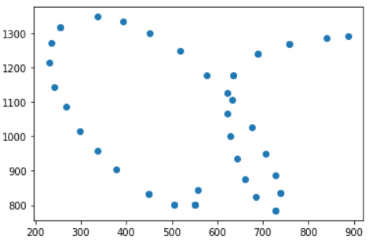

# _Character Recognition Project_

Following the paper Neural Networks for Pen Characters Recognition, this project focused on creating a Neural Network that can detect characters associated with inputted pen strokes. I applied the neural network to the 11640 characters of the data set ujipenchars2.txt. Below is a link to the code:

[Character Recognition Project](https://colab.research.google.com/drive/1puugDjDd5ZA180Iq7fJUtv7MOnLN8bZe?usp=sharing)

Here is a link to the data set used in this project:
[Pen Stroke Data Set](https://drive.google.com/file/d/1t3tU-ok9qsfY5h9EIKBKu4923c3nz_4n/view)

Here is a link to the paper used as reference for this project:
[Neural Networks for Pen Characters Recognition](https://drive.google.com/file/d/1efIYEeUqTo7mnRnm2WC8V7NWZR3DfvBL/view)

## Preprocessing Data

In the paper, they proposed two methods for processing pen input data in order to create meaningful features for the Neural Network. 

### Uniform Sampling

The first method proposed is uniform sampling. This is because the Neural Network requires inputs of equal dimensions. Uniform sampling would solve this problem by making all the characters have an equal number of points which are also uniformly distanced apart.
Because character inputs can be made up of multiple strokes, I had to first distribute the total number of points wanted between the strokes. To accomplish this, I calculated the length of each stroke so that I could figure out what percentage of the total character length was made up of each stroke. Then, I distributed the points to each stroke based on these percentages so that the points would be uniformly distributed around the character.
In order to implement uniform sampling, I made use of the Traja library. Their rediscretize function allowed me to resample each stroke by simply calculating and inputting a step length. 

Here is an example of a character input:

Here is the same input resampled to have 100 points:

