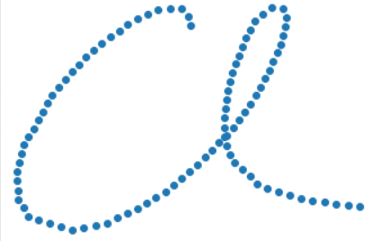

# _Character Recognition Project_

Following the paper Neural Networks for Pen Characters Recognition, this project focused on creating a Neural Network that can detect characters associated with inputted pen strokes. I applied the neural network to the 11640 characters of the data set ujipenchars2.txt. Below is a link to the code:

[Character Recognition Project](https://colab.research.google.com/drive/1puugDjDd5ZA180Iq7fJUtv7MOnLN8bZe?usp=sharing)

Here is a link to the data set used in this project:
[Pen Stroke Data Set](https://drive.google.com/file/d/1t3tU-ok9qsfY5h9EIKBKu4923c3nz_4n/view)

Here is a link to the paper used as reference for this project:
[Neural Networks for Pen Characters Recognition](https://drive.google.com/file/d/1efIYEeUqTo7mnRnm2WC8V7NWZR3DfvBL/view)

**Fig 1.** Illustration of how online pen strokes work from: Matcha, Anil Chandra Naidu. “Handwriting Recognition with ML (an in-Depth Guide).” Nanonets AI &amp; Machine Learning Blog, Nanonets AI &amp; Machine Learning Blog, 20 June 2022, https:​//nanonets.com/blog/handwritten-character-recognition/. 

**Fig 2.** Example input of pen strokes for the character 'a'.

## Preprocessing Data

In the paper, they proposed two methods for processing pen input data in order to create meaningful features for the Neural Network. 

### Uniform Sampling

The first method proposed is uniform sampling. This is because the Neural Network requires inputs of equal dimensions. Uniform sampling would solve this problem by making all the characters have an equal number of points which are also uniformly distanced apart.

Because character inputs can be made up of multiple strokes, I had to first distribute the total number of points wanted between the strokes. To accomplish this, I calculated the length of each stroke so that I could figure out what percentage of the total character length was made up of each stroke. Then, I distributed the points to each stroke based on these percentages so that the points would be uniformly distributed around the character.

In order to implement uniform sampling, I made use of the Traja library. Their rediscretize function allowed me to resample each stroke by simply calculating and inputting a step length. 

Here is an example of a character input:

**Fig 3.** Plot of input points from ujipenchars2.txt data set for the character 'a'.

Here is the same input resampled to have 100 points:

**Fig 4.** Plot of resampled points for the character 'a'.

### Normalization
The second method proposed in the paper is to normalize each character. The goal of normalization is to transform features to be on a similar scale which can improve model accuracy. Normalization keeps the neural network from being skewed by characters with very large or small point values. I decided to have all the characters fit in a range from 0 to 1. 
I made use of the sklearn MinMaxScaler which scales the largest values to be as large as 1 and the smallest values to be as small as 0. 

## Splitting Data
In order to get a precise measure of the Neural Network accuracy, I split the data into training, validation, and testing data. The training data consisted of 70% of the characters from our data set. Meanwhile, the validation and test data consisted of 15% each. After training with the training data, the validation data is used to evaluate the model so that the hyperparameters can be tuned to maximize accuracy. Finally, the test data is used to get a final evaluation of the model. 

Since the labels are characters and are therefore categorical values, I needed to convert them to numerical values. Two methods I tried were One Hot Encoding and Ordinal Encoding. One Hot Encoding creates a large grid of 0s and 1s where a cell is given a 1 if that row is of the type of the column’s character. Ordinal Encoding converts all unique characters to unique integers. Both methods were tested but didn’t seem to affect the Neural Network’s accuracy.  

Also, the data was stratified which means that characters were distributed evenly between the training, validation, and testing data. This allows the neural network to train on all possible characters so that it can properly identify them in validation and testing. 

## Implementing Neural Network
To implement the neural network, I followed instructions from the Andrew Ng course. I used Relu activation functions for the hidden layers and Softmax for the output layer. Also, I flattened the input of points into a 1D array. 

For the loss function, I tested using sparse categorical crossentropy and categorical crossentropy. This was because one-hot encoding only worked with categorical crossentropy. However, I didn’t find any notable difference in validation accuracy with either approach. I also tested fine-tuning other Neural Network hyperparameters like the number of hidden layers, number of neurons, and learning rates to see which produces the most accurate predictions.
Overall, I found that for the entire data set of 11640 characters, the model seemed to converge at a validation/test accuracy of 65%.

**Fig 5.** Plot of accuracy for model with entire data set.

While this accuracy seems low, through manually looking through the output, I found that the Neural Network made mistakes with similarly shaped characters. Given that there are 97 different possible character types, I found that the model’s mistakes seemed to be reasonable errors.

Examples of character mistakes:

Guessed a “U” for a “c”:
	

  

**Fig 6.** Graph of inputted character (“c”).

**Fig 7.** Graph of inputted character (“U”).

Guessed a “q” for a “g”:

**Fig 8.** Graph of inputted character (“g”).

**Fig 9.** Graph of inputted character (“q”).

Guessed a “‘’ for a “i”:

**Fig 10.** Graph of inputted character (“i”).

**Fig 11.** Graph of inputted character (“'”).

Furthermore, when given an input of just characters of the lowercase alphabet, the model produced a training accuracy of 96% and a validation/test accuracy of 87%.

 

**Fig 12.** Plot of accuracy for model with smaller data set.

Here is a link to the library I used for resampling:
https://github.com/traja-team/traja  
